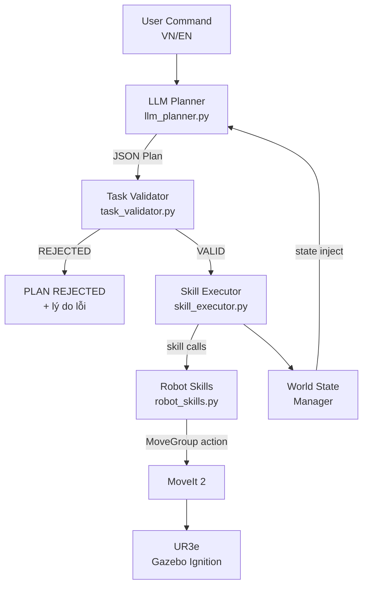

# 🤖 UR3e LLM Skill-based Planning Controller

**Điều khiển robot UR3/UR3e bằng LLM và Skill-based Planning**

| Thông tin | Giá trị |
|-----------|---------|
| Sinh viên | Đuc Tri |
| MSSV | 23020776 |
| P = 76 mod 6 | **4** |
| Zone A | `blue_cube` |
| Zone B | `red_cube` |
| Zone C | `yellow_cube` |

---

## 📐 Kiến trúc hệ thống

```
User Command (text, VI/EN)
        │
        ▼
┌──────────────────┐
│   LLM Planner    │  ← 9Router API (OpenAI-compatible)
│  llm_planner.py  │    + Smart Fallback rule-based
└────────┬─────────┘
         │  JSON plan: [{"skill": ..., "args": {...}}, ...]
         │  (kèm world_state inject vào prompt)
         ▼
┌──────────────────┐
│  Task Validator  │  ← Kiểm tra whitelist, logic, zone conflict
│ task_validator.py│    Mô phỏng world state để detect xung đột
└────────┬─────────┘
         │  Validated plan / PLAN REJECTED
         ▼
┌──────────────────┐
│  Skill Executor  │  ← skill_executor.py
│  World State Mgr │    Theo dõi vật ở đâu sau mỗi skill
└────────┬─────────┘
         │  Skill calls
         ▼
┌──────────────────┐
│   Robot Skills   │  ← robot_skills.py
│ home/pick/place  │    MoveIt 2 Action Client
└────────┬─────────┘
         │  MoveGroup goals + PlanningScene
         ▼
┌──────────────────┐
│    MoveIt 2      │  IK, collision avoidance, trajectory planning
└────────┬─────────┘
         │
         ▼
   UR3e (Gazebo Ignition) + Visual Markers (RViz)
```

### Sơ đồ luồng (Mermaid)



---

## 📦 Cấu trúc package

```
ur3_llm_control/
├── .env                          # API key (source trước khi chạy)
├── config/
│   ├── scene.yaml                # Tọa độ bàn, khối, zone, home joints
│   └── student_config.yaml       # MSSV, P=4, ánh xạ zone↔cube
├── launch/
│   └── llm_robot.launch.py       # Launch tất cả cùng lúc
├── ur3_llm_control/
│   ├── __init__.py
│   ├── llm_planner.py            # Gọi LLM API, sinh plan JSON
│   ├── task_validator.py         # Kiểm tra plan hợp lệ
│   ├── robot_skills.py           # MoveIt 2: pick/place/home
│   ├── scene_spawner.py          # Spawn bàn, khối, zone vào Gazebo
│   ├── skill_executor.py         # Node chính, giao diện nhập lệnh
│   ├── ur3_kinematics.py         # FK/IK liên tục cho UR3e
│   └── reset_world.py            # Xóa entity cũ trước khi spawn lại
├── test/
│   ├── conftest.py               # Cấu hình pytest (disable ROS plugins)
│   └── test_task_validator.py    # 50 unit tests (validator + mock LLM)
├── package.xml
├── setup.py
└── README.md
```

---

## ⚙️ Giải thích từng module

### `llm_planner.py` — LLM Task Planner
- Đọc API key từ env `LLM_API_KEY` / `NINE_ROUTER_API_KEY` / `OPENAI_API_KEY` (không hard-code)
- Đọc model từ env `LLM_MODEL` (default: `oc/muse-spark-1.2-contributor-free`)
- Xây dựng **System Prompt** chứa: skill whitelist, object/zone list, ánh xạ MSSV, few-shot VI+EN
- Inject **world_state** vào prompt để LLM biết trạng thái scene hiện tại
- Retry tối đa 3 lần nếu JSON parse lỗi (kèm corrective message)
- **Smart Fallback Planner**: rule-based nếu API không phản hồi (không phụ thuộc mạng)

### `task_validator.py` — Plan Validator
Kiểm tra theo thứ tự:
1. **Schema**: mỗi step có `skill` và `args`
2. **Whitelist skill**: chỉ `{pick, place, home, move_above, open_gripper, close_gripper}`
3. **Whitelist object**: `{red_cube, yellow_cube, blue_cube}`
4. **Whitelist zone**: `{zone_a, zone_b, zone_c, temp_zone}`
5. **Logic pick/place**: không pick khi đang giữ; place đúng vật đang giữ
6. **Kết thúc bằng `home()`**
7. **Giới hạn số bước**: tối đa 30 bước
8. **Zone conflict**: mô phỏng world state, phát hiện nếu zone đích đang bị vật khác chiếm
   - Nếu bị chiếm → báo lỗi, gợi ý dùng temp_zone

### `robot_skills.py` — Robot Skills
Trình tự `pick(obj)`:
1. `move_above(obj)` → approach_z = 0.20m
2. `open_gripper()` 
3. Hạ xuống `grasp_z = 0.05m` (Cartesian)
4. `close_gripper()` + attach object (Gazebo sync thread 20Hz)
5. Rút lên `retreat_z = 0.20m`

Trình tự `place(obj, zone)`:
1. `move_above(zone)` → approach_z
2. Hạ xuống `grasp_z`
3. `open_gripper()` + detach object → set Gazebo model pose
4. Rút lên

**Cơ chế giữ vật trong Gazebo**: Worker thread 20Hz đọc FK từ joint states, gọi Ignition service `/world/{world}/set_pose` để dịch chuyển model theo đầu công tác. Chọn cách này vì không cần gripper hardware (đơn giản, ổn định với UR3e không có gripper thật trong simulation).

### `skill_executor.py` — Skill Executor
- **WorldStateManager**: theo dõi `{obj: "table"|zone_name|"gripper"}` sau mỗi pick/place
- Truyền `world_state` vào LLM planner trước mỗi call để context-aware planning
- Truyền `initial_world_state` vào validator để detect zone conflict thực tế
- `--dry-run`: chỉ in plan, không gọi MoveIt
- `--mock-llm`: dùng Fallback Planner, không gọi API
- Gõ `state` trong console để in world state hiện tại

### `scene_spawner.py` — Scene Spawner
- Spawn bàn, 3 khối màu, 3 zone + temp_zone vào Gazebo qua `ros_gz_sim/create`
- Publish MoveIt PlanningScene (collision objects) và RViz MarkerArray
- Duy trì markers 1Hz để không biến mất sau timeout

---

## 🔢 Tính P theo MSSV

```
MSSV = 23020776
XX = 76 (2 chữ số cuối)
P = 76 mod 6 = 4

Bảng ánh xạ P=4:
  Zone A ← blue_cube
  Zone B ← red_cube
  Zone C ← yellow_cube
```

File `config/student_config.yaml` lưu ánh xạ này. Node đọc file YAML — **không hard-code**.

---

## 🔄 Xử lý xung đột zone (nâng cao)

Khi `"Arrange all objects according to my student ID."`:

**Cấu hình ban đầu không xung đột** (ví dụ: tất cả trên bàn):
```
blue_cube → zone_a
red_cube  → zone_b
yellow_cube → zone_c
```
→ LLM sinh plan thẳng, không cần temp_zone.

**Cấu hình gây xung đột** (ví dụ: red_cube đang ở zone_a):
```
Tình trạng:  red_cube ở zone_a, blue_cube ở bàn
Mục tiêu:    blue_cube ↦ zone_a, red_cube ↦ zone_b
Xung đột:    zone_a bị red_cube chiếm trước khi đặt blue_cube
```
→ LLM (có world_state trong prompt) sinh plan:
```
pick(red_cube) → place(red_cube, temp_zone)
pick(blue_cube) → place(blue_cube, zone_a)
pick(red_cube) → place(red_cube, zone_b)
...
home()
```

**Nếu LLM sinh plan sai** (đặt vào zone đang bị chiếm), validator TỪ CHỐI với lỗi cụ thể, và node có thể replan (gọi LLM lại với thông báo lỗi).

---

## 🚀 Hướng dẫn cài đặt

```bash
# 1. Cài thư viện Python
pip install openai pyyaml scipy numpy

# 2. Build package
cd ~/workspaces/ur_gz
colcon build --packages-select ur3_llm_control --symlink-install
source install/setup.bash
```

---

## ▶️ Hướng dẫn chạy (3 Terminal)

### Terminal 1 — Gazebo + MoveIt 2 + RViz
```bash
cd ~/workspaces/ur_gz && source install/setup.bash
ros2 launch ur_simulation_gz ur_sim_moveit.launch.py ur_type:=ur3e
```
⏳ Chờ Gazebo và RViz mở, robot đứng yên.

### Terminal 2 — Spawn scene (giữ chạy)
```bash
cd ~/workspaces/ur_gz && source install/setup.bash
ros2 run ur3_llm_control reset_world
ros2 run ur3_llm_control scene_spawner
```
✅ Thấy 3 khối màu, khay zone trong Gazebo và RViz.

### Terminal 3 — LLM Controller
```bash
9router -n -t
cd ~/workspaces/ur_gz && source install/setup.bash
source src/ur3_llm_control/.env  # Load API key
ros2 run ur3_llm_control skill_executor
```

**Chế độ thay thế:**
```bash
# Dry-run (không di chuyển robot, test plan logic)
ros2 run ur3_llm_control skill_executor --dry-run

# Mock LLM (không cần mạng, dùng Fallback Planner)
ros2 run ur3_llm_control skill_executor --mock-llm

# Cả hai
ros2 run ur3_llm_control skill_executor --dry-run --mock-llm
```

---

## 🧪 Chạy Unit Tests

```bash
cd ~/workspaces/ur_gz/src/ur3_llm_control

# Cách 1: Môi trường clean (khuyến nghị để tránh plugin conflict)
env -i HOME=/home/ductri PATH=/usr/local/sbin:/usr/local/bin:/usr/sbin:/usr/bin:/sbin:/bin:/home/ductri/.local/bin \
  PYTHONPATH=$(pwd) \
  pytest test/test_task_validator.py -v

# Cách 2: Trong môi trường ROS 2 đã source
source /opt/ros/humble/setup.bash && source ~/workspaces/ur_gz/install/setup.bash
PYTHONPATH=$(pwd):$PYTHONPATH pytest test/test_task_validator.py -v
```

**Kết quả mong đợi:** `50 passed in 0.03s`

---

## 💬 Cú pháp lệnh

| Loại | Ví dụ lệnh |
|------|-----------|
| 🇬🇧 Tiếng Anh | `Please put the red cube in zone B.` |
| 🇬🇧 Tiếng Anh | `Move the blue cube to zone A.` |
| 🇻🇳 Tiếng Việt | `Đưa khối màu đỏ vào vùng B.` |
| 🇻🇳 Tiếng Việt | `Hãy lấy khối màu vàng và đặt nó vào ô A.` |
| 🎓 Theo MSSV | `Arrange all objects according to my student ID.` |
| 🎓 Theo MSSV | `Sắp xếp theo MSSV.` |
| 🏠 Home | `Go home.` |
| 📊 Xem state | `state` (gõ trong console) |

---

## 📺 Output mẫu

### Lệnh cơ bản thành công
```
================================================================
USER COMMAND:
Please put the red cube in zone B.

[*] Đang gửi lệnh tới LLM...
[LLMPlanner] ✓ Plan nhận từ LLM (3 bước).

LLM PLAN:
pick(red_cube)
place(red_cube, zone_b)
home()

EXECUTION:
pick(red_cube) ........................ SUCCESS
place(red_cube, zone_b) .............. SUCCESS
home() ................................ SUCCESS

TASK SUCCESS
================================================================
```

### Plan bị từ chối (PLAN REJECTED)
```
================================================================
USER COMMAND:
fly to the moon

LLM PLAN:
(plan rỗng — lệnh không liên quan hoặc không thực hiện được)

TASK SKIPPED (no action required)
================================================================
```

```
================================================================
USER COMMAND:
pick green_cube and fly it to zone_d

LLM PLAN:
fly(green_cube)
place(green_cube, zone_d)
home()

PLAN REJECTED:
  ✗ Step 1: Skill 'fly' KHÔNG hợp lệ. Whitelist: [...]
  ✗ Step 2: place(): object 'green_cube' KHÔNG hợp lệ.
  ✗ Step 2: place(): zone 'zone_d' KHÔNG hợp lệ.

PLAN REJECTED — Không thực thi.
================================================================
```

### Sắp xếp theo MSSV (P=4)
```
================================================================
USER COMMAND:
Arrange all objects according to my student ID.

LLM PLAN:
pick(blue_cube)
place(blue_cube, zone_a)
pick(red_cube)
place(red_cube, zone_b)
pick(yellow_cube)
place(yellow_cube, zone_c)
home()

EXECUTION:
pick(blue_cube) ....................... SUCCESS
place(blue_cube, zone_a) ............. SUCCESS
pick(red_cube) ........................ SUCCESS
place(red_cube, zone_b) .............. SUCCESS
pick(yellow_cube) ..................... SUCCESS
place(yellow_cube, zone_c) ........... SUCCESS
home() ................................ SUCCESS

TASK SUCCESS
================================================================
```

---

## 🔁 Chạy lại (không tắt Gazebo)

```bash
# Xóa entity cũ
ros2 run ur3_llm_control reset_world

# Spawn lại
ros2 run ur3_llm_control scene_spawner

# Chạy lại executor
source src/ur3_llm_control/.env
ros2 run ur3_llm_control skill_executor
```

---

## 🔧 Debug lỗi thường gặp

| Lỗi | Nguyên nhân | Giải pháp |
|-----|-------------|-----------|
| `error_code = -4` | Robot chưa ổn định | Đợi Terminal 1 hoàn toàn ổn định, thử lại |
| `PLANNING_FAILED` | IK fail / vị trí ngoài tầm | Gõ `Go home.` → thử lại; kiểm tra scene.yaml |
| `Visual already exists` | Gazebo còn object cũ | Chạy `reset_world` trước `scene_spawner` |
| `API error: Connection error` | 9Router chưa chạy | Tự động dùng Fallback Planner |
| `No module named 'openai'` | Thiếu thư viện | `pip install openai` |
| Markers không hiện RViz | scene_spawner tắt | Giữ Terminal 2 luôn chạy |
| MoveGroup timeout | MoveIt chưa sẵn sàng | Đợi thêm 10-20s sau khi Gazebo mở |
| WSL2: Gazebo không mở | DISPLAY chưa set | `export DISPLAY=:0` hoặc dùng VcXsrv |

---

## ⚠️ Hạn chế đã biết

1. **Gripper ảo**: UR3e trong simulation không có gripper thật. Vật được "giữ" bằng worker thread 20Hz gọi Ignition API. Nếu latency cao, vật có thể lag theo tay.
2. **Vị trí cube**: Tọa độ trong scene.yaml đã được tính toán để nằm trong sweet-spot 0.20–0.38m. Nếu thay đổi vị trí, cần verify IK.
3. **No camera**: Bài tập không yêu cầu camera → vị trí vật là cố định theo config.
4. **Cycle detection**: Xử lý xung đột zone dựa vào LLM (với world_state inject) + validator. Chưa có thuật toán cycle detection tự động hoàn toàn phía executor.
5. **Replan limit**: Hiện chỉ retry LLM khi JSON parse lỗi, chưa retry khi validator reject (planned improvement).
